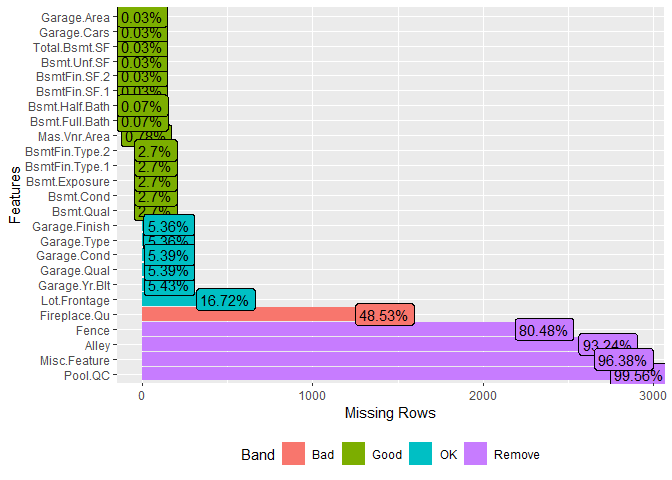
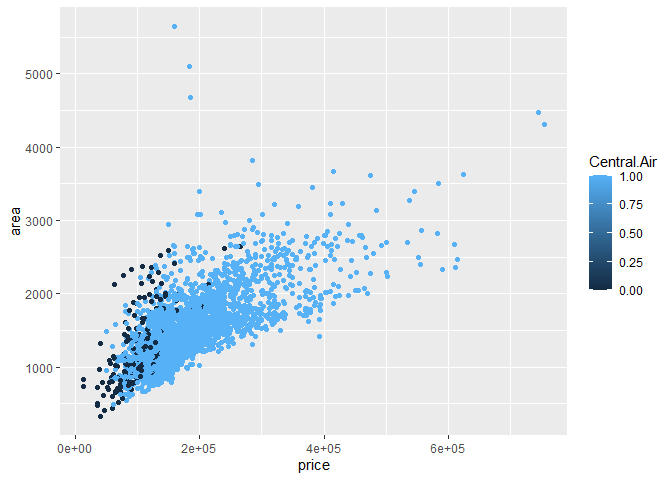
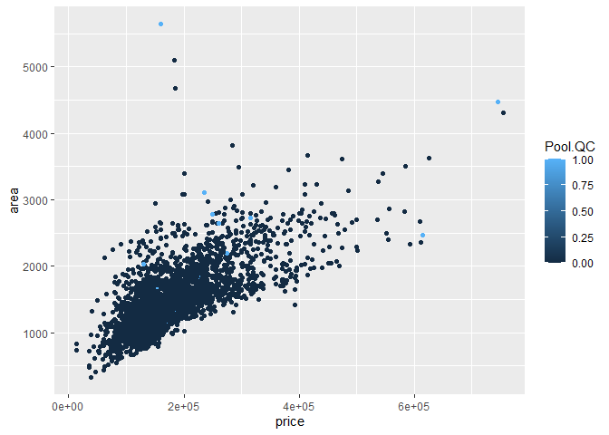
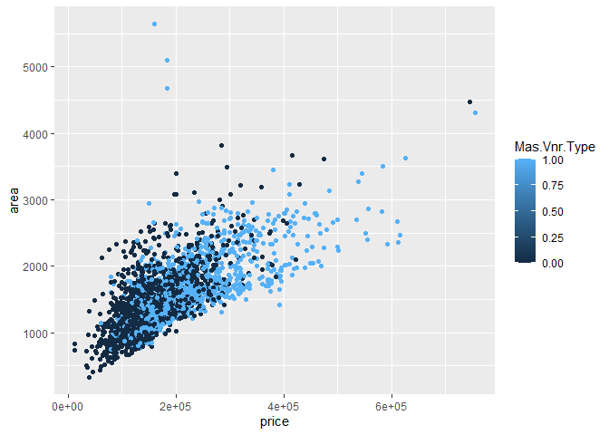
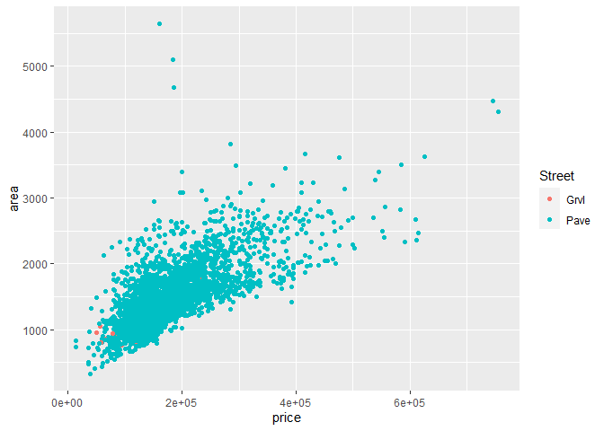
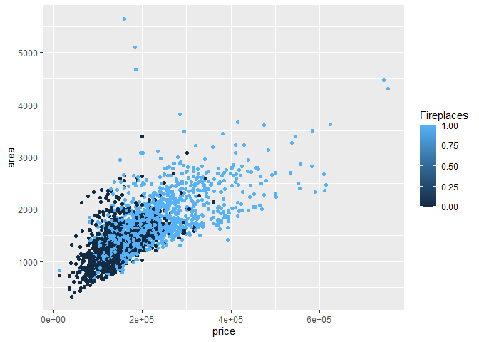
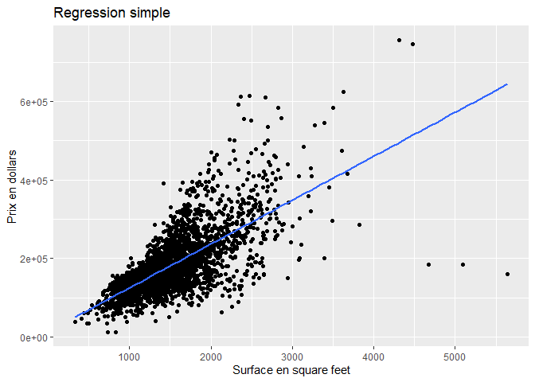

R Code
================
DAAB Valentin
08/02/2022

## Librairies utilisées

``` r
library(openintro)
library(corrplot)
library(dplyr)
library(ggplot2)
library(caret)
library(stargazer)
library(lmtest)
library(stats)
library(sandwich)
library(DataExplorer)
library(car)
library(ggfortify)
library(EnvStats)
library(measurements)
```

## Importation des données

``` r
data(ames)
data <- as.data.frame(ames)
head(data)
```

    ##   Order       PID area  price MS.SubClass MS.Zoning Lot.Frontage Lot.Area
    ## 1     1 526301100 1656 215000          20        RL          141    31770
    ## 2     2 526350040  896 105000          20        RH           80    11622
    ## 3     3 526351010 1329 172000          20        RL           81    14267
    ## 4     4 526353030 2110 244000          20        RL           93    11160
    ## 5     5 527105010 1629 189900          60        RL           74    13830
    ## 6     6 527105030 1604 195500          60        RL           78     9978
    ##   Street Alley Lot.Shape Land.Contour Utilities Lot.Config Land.Slope
    ## 1   Pave  <NA>       IR1          Lvl    AllPub     Corner        Gtl
    ## 2   Pave  <NA>       Reg          Lvl    AllPub     Inside        Gtl
    ## 3   Pave  <NA>       IR1          Lvl    AllPub     Corner        Gtl
    ## 4   Pave  <NA>       Reg          Lvl    AllPub     Corner        Gtl
    ## 5   Pave  <NA>       IR1          Lvl    AllPub     Inside        Gtl
    ## 6   Pave  <NA>       IR1          Lvl    AllPub     Inside        Gtl
    ##   Neighborhood Condition.1 Condition.2 Bldg.Type House.Style Overall.Qual
    ## 1        NAmes        Norm        Norm      1Fam      1Story            6
    ## 2        NAmes       Feedr        Norm      1Fam      1Story            5
    ## 3        NAmes        Norm        Norm      1Fam      1Story            6
    ## 4        NAmes        Norm        Norm      1Fam      1Story            7
    ## 5      Gilbert        Norm        Norm      1Fam      2Story            5
    ## 6      Gilbert        Norm        Norm      1Fam      2Story            6
    ##   Overall.Cond Year.Built Year.Remod.Add Roof.Style Roof.Matl Exterior.1st
    ## 1            5       1960           1960        Hip   CompShg      BrkFace
    ## 2            6       1961           1961      Gable   CompShg      VinylSd
    ## 3            6       1958           1958        Hip   CompShg      Wd Sdng
    ## 4            5       1968           1968        Hip   CompShg      BrkFace
    ## 5            5       1997           1998      Gable   CompShg      VinylSd
    ## 6            6       1998           1998      Gable   CompShg      VinylSd
    ##   Exterior.2nd Mas.Vnr.Type Mas.Vnr.Area Exter.Qual Exter.Cond Foundation
    ## 1      Plywood        Stone          112         TA         TA     CBlock
    ## 2      VinylSd         None            0         TA         TA     CBlock
    ## 3      Wd Sdng      BrkFace          108         TA         TA     CBlock
    ## 4      BrkFace         None            0         Gd         TA     CBlock
    ## 5      VinylSd         None            0         TA         TA      PConc
    ## 6      VinylSd      BrkFace           20         TA         TA      PConc
    ##   Bsmt.Qual Bsmt.Cond Bsmt.Exposure BsmtFin.Type.1 BsmtFin.SF.1 BsmtFin.Type.2
    ## 1        TA        Gd            Gd            BLQ          639            Unf
    ## 2        TA        TA            No            Rec          468            LwQ
    ## 3        TA        TA            No            ALQ          923            Unf
    ## 4        TA        TA            No            ALQ         1065            Unf
    ## 5        Gd        TA            No            GLQ          791            Unf
    ## 6        TA        TA            No            GLQ          602            Unf
    ##   BsmtFin.SF.2 Bsmt.Unf.SF Total.Bsmt.SF Heating Heating.QC Central.Air
    ## 1            0         441          1080    GasA         Fa           Y
    ## 2          144         270           882    GasA         TA           Y
    ## 3            0         406          1329    GasA         TA           Y
    ## 4            0        1045          2110    GasA         Ex           Y
    ## 5            0         137           928    GasA         Gd           Y
    ## 6            0         324           926    GasA         Ex           Y
    ##   Electrical X1st.Flr.SF X2nd.Flr.SF Low.Qual.Fin.SF Bsmt.Full.Bath
    ## 1      SBrkr        1656           0               0              1
    ## 2      SBrkr         896           0               0              0
    ## 3      SBrkr        1329           0               0              0
    ## 4      SBrkr        2110           0               0              1
    ## 5      SBrkr         928         701               0              0
    ## 6      SBrkr         926         678               0              0
    ##   Bsmt.Half.Bath Full.Bath Half.Bath Bedroom.AbvGr Kitchen.AbvGr Kitchen.Qual
    ## 1              0         1         0             3             1           TA
    ## 2              0         1         0             2             1           TA
    ## 3              0         1         1             3             1           Gd
    ## 4              0         2         1             3             1           Ex
    ## 5              0         2         1             3             1           TA
    ## 6              0         2         1             3             1           Gd
    ##   TotRms.AbvGrd Functional Fireplaces Fireplace.Qu Garage.Type Garage.Yr.Blt
    ## 1             7        Typ          2           Gd      Attchd          1960
    ## 2             5        Typ          0         <NA>      Attchd          1961
    ## 3             6        Typ          0         <NA>      Attchd          1958
    ## 4             8        Typ          2           TA      Attchd          1968
    ## 5             6        Typ          1           TA      Attchd          1997
    ## 6             7        Typ          1           Gd      Attchd          1998
    ##   Garage.Finish Garage.Cars Garage.Area Garage.Qual Garage.Cond Paved.Drive
    ## 1           Fin           2         528          TA          TA           P
    ## 2           Unf           1         730          TA          TA           Y
    ## 3           Unf           1         312          TA          TA           Y
    ## 4           Fin           2         522          TA          TA           Y
    ## 5           Fin           2         482          TA          TA           Y
    ## 6           Fin           2         470          TA          TA           Y
    ##   Wood.Deck.SF Open.Porch.SF Enclosed.Porch X3Ssn.Porch Screen.Porch Pool.Area
    ## 1          210            62              0           0            0         0
    ## 2          140             0              0           0          120         0
    ## 3          393            36              0           0            0         0
    ## 4            0             0              0           0            0         0
    ## 5          212            34              0           0            0         0
    ## 6          360            36              0           0            0         0
    ##   Pool.QC Fence Misc.Feature Misc.Val Mo.Sold Yr.Sold Sale.Type Sale.Condition
    ## 1    <NA>  <NA>         <NA>        0       5    2010       WD          Normal
    ## 2    <NA> MnPrv         <NA>        0       6    2010       WD          Normal
    ## 3    <NA>  <NA>         Gar2    12500       6    2010       WD          Normal
    ## 4    <NA>  <NA>         <NA>        0       4    2010       WD          Normal
    ## 5    <NA> MnPrv         <NA>        0       3    2010       WD          Normal
    ## 6    <NA>  <NA>         <NA>        0       6    2010       WD          Normal

## Graphique des données manquantes

``` r
plot_missing(data, missing_only = T)
```

<!-- -->

Certaines données sont manquantes mais dans le cadre de la variable Pool
par exemple, ‘NA’ signifie qu’il n’y a pas de piscine. Il faut alors
modifier la variable.

## Changement des variables catégorielles (pas encore abordées en cours) en variables binaires

``` r
data <- data %>% mutate(Pool.QC = ifelse(is.na(Pool.QC), 0, 1))
data <- data %>% mutate(Central.Air = ifelse(Central.Air == "Y", 1, 0))
data <- data %>% mutate(Mas.Vnr.Type = ifelse(Mas.Vnr.Type == "None", 0, 1))
data <- data %>% mutate(Fireplaces = ifelse(Fireplaces == "0", 0, 1))
```

## Graphiques de visualisation des données

``` r
ggplot(data = data, aes(x = price, y = area, color = Central.Air)) + 
  geom_point()
```

<!-- -->

``` r
ggplot(data = data, aes(x = price, y = area, color = Pool.QC)) + 
  geom_point()
```

<!-- -->

``` r
ggplot(data = data, aes(x = price, y = area, color = Mas.Vnr.Type)) + 
  geom_point()
```

<!-- -->

``` r
ggplot(data = data, aes(x = price, y = area, color = Street)) + 
  geom_point()
```

<!-- -->

``` r
ggplot(data = data, aes(x = price, y = area, color = Fireplaces)) + 
  geom_point()
```

<!-- -->

On peut constater que les maisons possédant une climatisation ou une
façade en brique (Mas.Vnr.Type) sont plus coûteuses. Pour reprendre
l’exemple des piscines (Pool.QC), il n’y a pas assez d’habitations qui
en possèdent, la variable ne sera donc pas significative. Idem pour la
variable Street.

## Création d’un data frame avec les variables sélectionnées

``` r
xxx <- data %>%
  select(area, price, Lot.Area, Total.Bsmt.SF, Garage.Area, Mas.Vnr.Area, Mas.Vnr.Type, Central.Air, Fireplaces) 
```

Variables sélectionnées :

-   Area : Surface habitable (en square feet)
-   Price : Prix (en dollars)
-   Lot.Area : Surface du terrain (en sq ft)
-   Total.Bsmt.SF : Surface de la cave (en sq ft)
-   Garage.Area : Surface du garage (en sq ft)
-   Mas.Vnr.Area : Surface de la façade en briques (en sq ft)
-   Mas.Vnr.Type : Façade en brique ou pas
-   Central.Air : Climatisation ou pas
-   Fireplaces : Cheminée ou pas

## Statistiques Descriptives

``` r
stargazer(xxx, 
          type = "text",
          title = "Statistiques Descriptives des variables sélectionnées")
```

    ## 
    ## Statistiques Descriptives des variables sélectionnées
    ## ==============================================================================
    ## Statistic       N      Mean      St. Dev.   Min   Pctl(25) Pctl(75)     Max   
    ## ------------------------------------------------------------------------------
    ## area          2,930  1,499.690   505.509    334    1,126    1,742.8    5,642  
    ## price         2,930 180,796.100 79,886.690 12,789 129,500   213,500   755,000 
    ## Lot.Area      2,930 10,147.920  7,880.018  1,300  7,440.2  11,555.2   215,245 
    ## Total.Bsmt.SF 2,929  1,051.615   440.615   0.000  793.000  1,302.000 6,110.000
    ## Garage.Area   2,929   472.820    215.047   0.000  320.000   576.000  1,488.000
    ## Mas.Vnr.Area  2,907   101.897    179.113   0.000   0.000    164.000  1,600.000
    ## Mas.Vnr.Type  2,930    0.402      0.490      0       0         1         1    
    ## Central.Air   2,930    0.933      0.250      0       1         1         1    
    ## Fireplaces    2,930    0.515      0.500      0       0         1         1    
    ## ------------------------------------------------------------------------------

Quelques interprétations :

-   La surface habitable moyenne est d’environ 1500 square feet (140m²)
-   Le prix moyen est de 180 796 dollars
-   93% des maisons possèdent une climatisation
-   51% des maisons possèdent une cheminée

## Régression selon les MCO + Graphique

``` r
lm1 = lm(price ~ area, data = ames)
summary(lm1)
```

    ## 
    ## Call:
    ## lm(formula = price ~ area, data = ames)
    ## 
    ## Residuals:
    ##     Min      1Q  Median      3Q     Max 
    ## -483467  -30219   -1966   22728  334323 
    ## 
    ## Coefficients:
    ##              Estimate Std. Error t value Pr(>|t|)    
    ## (Intercept) 13289.634   3269.703   4.064 4.94e-05 ***
    ## area          111.694      2.066  54.061  < 2e-16 ***
    ## ---
    ## Signif. codes:  0 '***' 0.001 '**' 0.01 '*' 0.05 '.' 0.1 ' ' 1
    ## 
    ## Residual standard error: 56520 on 2928 degrees of freedom
    ## Multiple R-squared:  0.4995, Adjusted R-squared:  0.4994 
    ## F-statistic:  2923 on 1 and 2928 DF,  p-value: < 2.2e-16

``` r
ggplot(ames, aes(x = area, y = price)) +
  geom_point() +
  geom_smooth(method = "lm", se = FALSE, size = 1) +
  labs(x = "Surface en square feet", 
        y = "Prix en dollars",
        title = "Regression simple")
```

    ## `geom_smooth()` using formula 'y ~ x'

<!-- -->

Interprétation :

-   Une hausse de la surface de 10 sq ft, augmente le prix de vente de
    la maison de 1116.94 dollars, toutes choses égales par ailleurs.

## Test de Breusch-Pagan (indique la présence d’hétéroscédasticité)

``` r
bptest(lm1)
```

    ## 
    ##  studentized Breusch-Pagan test
    ## 
    ## data:  lm1
    ## BP = 592.39, df = 1, p-value < 2.2e-16

Ici, la p-value est inférieure au seuil de significativité, il y a donc
présence d’hétéroscédasticité. Le graphique précédent le confirme.

## Utiliser l’écart type robuste va nous permettre d’interpréter correctement.

``` r
coeftest(lm1, vcov = vcovHC(lm1, type = "HC0"))
```

    ## 
    ## t test of coefficients:
    ## 
    ##               Estimate Std. Error t value Pr(>|t|)    
    ## (Intercept) 13289.6344  6572.6413   2.022  0.04327 *  
    ## area          111.6940     4.7407  23.561  < 2e-16 ***
    ## ---
    ## Signif. codes:  0 '***' 0.001 '**' 0.01 '*' 0.05 '.' 0.1 ' ' 1

La variable Area reste significative.

## Régression multiple avec toutes les variables sélectionnées + Test de Breusch-Pagan + Ecarts type robustes

``` r
lm.fit <- lm(price ~ area
             + Lot.Area
             + Total.Bsmt.SF
             + Garage.Area
             + Mas.Vnr.Type
             + Mas.Vnr.Area
             + Central.Air
             + Fireplaces
             , data = data )  

summary(lm.fit)
```

    ## 
    ## Call:
    ## lm(formula = price ~ area + Lot.Area + Total.Bsmt.SF + Garage.Area + 
    ##     Mas.Vnr.Type + Mas.Vnr.Area + Central.Air + Fireplaces, data = data)
    ## 
    ## Residuals:
    ##     Min      1Q  Median      3Q     Max 
    ## -627986  -20724     380   19084  296306 
    ## 
    ## Coefficients:
    ##                 Estimate Std. Error t value Pr(>|t|)    
    ## (Intercept)   -2.997e+04  3.886e+03  -7.712 1.69e-14 ***
    ## area           5.798e+01  2.048e+00  28.313  < 2e-16 ***
    ## Lot.Area       8.255e-02  1.071e-01   0.771    0.441    
    ## Total.Bsmt.SF  4.543e+01  2.249e+00  20.202  < 2e-16 ***
    ## Garage.Area    8.689e+01  4.680e+00  18.568  < 2e-16 ***
    ## Mas.Vnr.Type   1.110e+02  2.330e+03   0.048    0.962    
    ## Mas.Vnr.Area   5.819e+01  6.591e+00   8.828  < 2e-16 ***
    ## Central.Air    1.960e+04  3.354e+03   5.842 5.72e-09 ***
    ## Fireplaces     1.879e+04  1.829e+03  10.275  < 2e-16 ***
    ## ---
    ## Signif. codes:  0 '***' 0.001 '**' 0.01 '*' 0.05 '.' 0.1 ' ' 1
    ## 
    ## Residual standard error: 43010 on 2896 degrees of freedom
    ##   (25 observations effacées parce que manquantes)
    ## Multiple R-squared:  0.7104, Adjusted R-squared:  0.7096 
    ## F-statistic: 888.1 on 8 and 2896 DF,  p-value: < 2.2e-16

``` r
bptest(lm.fit)
```

    ## 
    ##  studentized Breusch-Pagan test
    ## 
    ## data:  lm.fit
    ## BP = 676.04, df = 8, p-value < 2.2e-16

``` r
coeftest(lm.fit, vcov = vcovHC(lm.fit, type = "HC0"))
```

    ## 
    ## t test of coefficients:
    ## 
    ##                  Estimate  Std. Error t value  Pr(>|t|)    
    ## (Intercept)   -2.9969e+04  9.2311e+03 -3.2465  0.001182 ** 
    ## area           5.7976e+01  4.3406e+00 13.3569 < 2.2e-16 ***
    ## Lot.Area       8.2547e-02  1.8112e-01  0.4558  0.648604    
    ## Total.Bsmt.SF  4.5426e+01  7.3170e+00  6.2083 6.123e-10 ***
    ## Garage.Area    8.6889e+01  6.3171e+00 13.7547 < 2.2e-16 ***
    ## Mas.Vnr.Type   1.1101e+02  3.8028e+03  0.0292  0.976714    
    ## Mas.Vnr.Area   5.8186e+01  1.3461e+01  4.3225 1.595e-05 ***
    ## Central.Air    1.9597e+04  3.0835e+03  6.3553 2.408e-10 ***
    ## Fireplaces     1.8792e+04  2.7326e+03  6.8769 7.464e-12 ***
    ## ---
    ## Signif. codes:  0 '***' 0.001 '**' 0.01 '*' 0.05 '.' 0.1 ' ' 1

Quelques interprétations après avoir corrigé l’hétéroscédasticité:

-   Les variables que sont la surface du terrain et la présence d’une
    façade en briques ou non ne sont pas significatives.
-   La présence d’une climatisation augmente le prix de 19 597 dollars
    (toutes choses égales par ailleurs).
-   La présence d’une cheminée augmente le prix de 18 792 dollars.
-   1 square feet de garage en plus, augmente le prix de 87 dollars
    environ.
-   Ici, 1 square feet de surface habitable en plus, augmente le prix de
    58 dollars environ.
